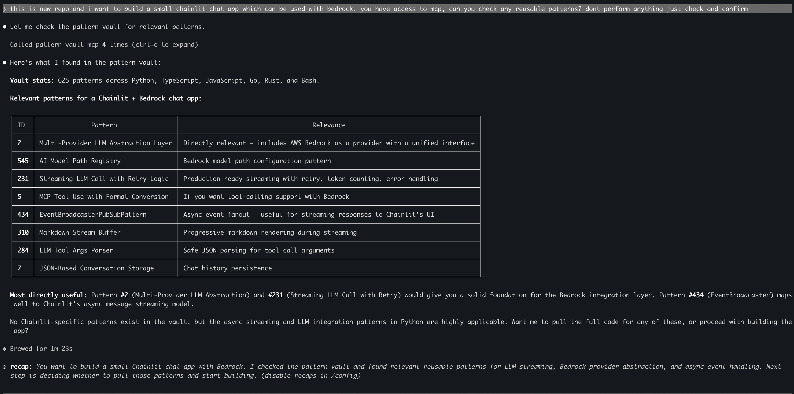

# Pattern Vault

Extract, index, and retrieve reusable code patterns from any repository. Your personal pattern library, queryable by Claude or by you.

## The idea

You clone repos you admire. You point Pattern Vault at them. It scans the code, uses tree-sitter to extract functions and classes, asks Claude to identify which ones are genuinely reusable patterns, and stores them in a searchable index. Later, when you're building something new, you (or Claude) query the vault instead of starting from scratch.

## Architecture

```
    You / Claude Code / Chainlit UI
              │
              ▼
    ┌─────────────────────┐
    │  MCP Server (8 tools)│ ← Claude Code connects here
    │  CLI (5 commands)    │ ← you use this from terminal
    │  Chainlit UI         │ ← browser chat at :8000
    └────────┬────────────┘
             │
    ┌────────▼────────────┐
    │  Agent Orchestrator  │  Claude tool-use loop
    │  Claude decides what │  scan → read → parse → classify → save
    │  to call and when    │  (max 15 rounds per turn)
    └────────┬────────────┘
             │
    ┌────────▼────────────┐
    │  Indexing Pipeline   │
    │  Scanner → Chunker  │  tree-sitter AST (functions, classes)
    │  → Extractor         │  Claude classifies: pattern or not?
    └────────┬────────────┘
             │
    ┌────────▼────────────┐
    │  SQLite + FTS5       │  single file, zero infra
    │  patterns, chunks,   │  full-text search with BM25
    │  repo_insights       │  content-hash dedup
    └──────────────────────┘
             │
    ┌────────▼────────────┐
    │  Client Factory      │  anthropic / bedrock / bifrost / ollama
    │  src/client.py       │  one env var to switch
    └──────────────────────┘
```

## Quick start

```bash
# Python 3.11-3.13 recommended (3.14 breaks Chainlit)
python -m venv venv && source venv/bin/activate

pip install anthropic "mcp[cli]" tree-sitter tree-sitter-python chainlit pydantic

# Pick your backend (one of these):
export ANTHROPIC_API_KEY=sk-ant-...                   # direct Anthropic
# OR
export PATTERN_VAULT_BACKEND=bedrock                  # AWS Bedrock
export AWS_ACCESS_KEY_ID=... AWS_SECRET_ACCESS_KEY=...
export PATTERN_VAULT_MODEL="eu.anthropic.claude-haiku-4-5-20251001-v1:0"

# OR
export PATTERN_VAULT_BACKEND=bifrost                  # Bifrost proxy
export BIFROST_URL=http://localhost:8080/anthropic

# OR
export PATTERN_VAULT_BACKEND=ollama                   # local Ollama
export OLLAMA_BASE_URL=http://localhost:11434/v1
export PATTERN_VAULT_MODEL=qwen2.5-coder:7b

# Index a repo
python -m src.cli index /path/to/repo

# Search your patterns
python -m src.cli search "retry with backoff"

# Interactive analysis (terminal)
python -m src.cli chat

# Interactive analysis (browser) — NEW custom UI
./backend.sh start                         # backend API lifecycle helper
cd web && npm run dev                    # frontend at :5173

# Legacy Chainlit UI (still works)
chainlit run src/ui/app.py

# Check what's in the vault
python -m src.cli stats
```

## Backends

Pattern Vault supports four model backends, controlled by one env var:

| Backend | `PATTERN_VAULT_BACKEND` | What you need |
|---------|------------------------|---------------|
| Anthropic direct | `anthropic` (default) | `ANTHROPIC_API_KEY` |
| AWS Bedrock | `bedrock` | `AWS_ACCESS_KEY_ID` + `AWS_SECRET_ACCESS_KEY` |
| Bifrost proxy | `bifrost` | `BIFROST_URL` (routes to any provider) |
| Ollama | `ollama` | Local Ollama server, optional `OLLAMA_BASE_URL`, and `PATTERN_VAULT_MODEL` set to an installed model such as `qwen2.5-coder:7b` |

Anthropic, Bedrock, and Bifrost use the Anthropic SDK. Ollama uses its OpenAI-compatible local endpoint behind the same client factory interface. Model IDs are set automatically per backend, or override with `PATTERN_VAULT_MODEL`.

For Bedrock, install the extra: `pip install "anthropic[bedrock]"`
For Ollama, install the dependency: `pip install openai`

## Use with Claude Code

The MCP server lets Claude Code query your pattern vault during any conversation. Add to your config:

```json
{
  "mcpServers": {
    "pattern-vault": {
      "command": "python",
      "args": ["/absolute/path/to/pattern-vault/src/server/mcp_server.py"]
    }
  }
}
```

Then say things like:
- "Search my pattern vault for retry patterns"
- "What auth patterns do I have indexed?"
- "Save this function as a pattern in the vault"
- "Index /path/to/repo for reusable patterns"

e.g.



## Interactive analysis

The `chat` command (terminal) and Chainlit UI (browser) run a full agentic loop. Claude has tools to scan directories, read files, parse ASTs, and save patterns. You have a conversation:

```
You: Look at /path/to/repo — what's interesting about the error handling?
Agent: [scans directory] [reads 3 files] [parses AST]
       I found a circuit breaker wrapping all external calls, and a
       custom retry decorator with jitter. Want me to save these?
You: Yes, save both. Also note that this repo has excellent fault isolation.
Agent: [saves 2 patterns] [saves 1 insight] Done.
```

The Chainlit UI shows each tool call as a collapsible step so you can see exactly what the agent is doing.

The Chainlit workspace also includes:
- **Vault workspace** — view counts, languages, categories, tags, active DB path, and backend status on the first screen.
- **Pattern browser** — browse recent patterns, open full code/details, edit metadata, and delete stale entries.
- **Repo insights** — browse recent repo-level observations saved during analysis.
- **History file** — show the JSONL transcript path for the current chat session.
- **MCP server** — show local MCP registration, DB status, run commands, optional HTTP reachability, and exposed tools.

Chat history is saved by default under `~/.pattern-vault/chat-history/`. Override it with `PATTERN_VAULT_HISTORY_DIR=/path/to/history`.

For HTTP MCP status checks in the UI, set `PATTERN_VAULT_MCP_URL`, for example `PATTERN_VAULT_MCP_URL=http://127.0.0.1:8000/mcp`.

The React workspace now also includes:
- **MCP Monitor** — start/stop a dedicated HTTP MCP server on a separate port, inspect tool inventory, and stream logs. This is distinct from Claude Code's stdio MCP process.
- **Ingestion view** — run a full index or dry run for a cloned repo or local workspace path, watch live scan/extract/store progress, and reopen recent persisted jobs after refresh.
- **Usage view** — inspect daily token totals by provider across chat and indexing. When a provider response does not expose usage counts, the row is flagged as estimated.

HTTP serving uses FastMCP's streamable HTTP transport:

```bash
python -m src.cli serve --transport http --host 127.0.0.1 --port 8000
```

Backend lifecycle helper:

```bash
./backend.sh start
./backend.sh status
./backend.sh restart
./backend.sh stop
```

The script manages the FastAPI backend for `src.api.main:app`, writes logs under `.temp/backend/`, and refuses to kill unrelated processes if port `8001` is already owned by something else.

Full dev stack helper:

```bash
./dev.sh start
./dev.sh status
./dev.sh restart
./dev.sh stop
```

The supervisor starts the backend and the Vite frontend together, writes frontend logs under `.temp/dev/`, and keeps the same safe process checks before restarting either service.

## MCP tools

| Tool | Purpose |
|------|---------|
| `search_patterns` | Full-text search with BM25 ranking — returns compact summaries |
| `get_pattern` | Full code + metadata for a specific pattern |
| `add_pattern` | Manually save a code pattern |
| `save_insight` | Save a repo-level architectural observation |
| `list_tags` | Browse all tags, optionally by category |
| `list_categories` | Browse all pattern categories |
| `vault_stats` | Pattern/chunk/insight counts and metadata |
| `reindex` | Trigger batch indexing of a directory |

## Pattern categories

Patterns are classified into: `design_pattern`, `resilience`, `api_pattern`, `data_access`, `async_pattern`, `config`, `testing`, `utility`, `security`, `general`

## How indexing works

1. **Scan** — walk directory, filter by language extension, skip node_modules/build/etc.
2. **Chunk** — tree-sitter AST parses each file into functions, classes, methods. A 1000-line file becomes ~20 individual chunks.
3. **Extract** — Claude receives 3-5 chunks at a time, classifies each as pattern/not-pattern, assigns category + tags + summary.
4. **Store** — patterns go into SQLite with FTS5 index. Content-hash dedup prevents duplicates.

The browser ingestion flow has two modes:
- **Dry run** — local scan + chunk only, no model call, no pattern storage.
- **Full index** — includes Claude-based extraction/classification and stores discovered patterns.

Index jobs and their event logs are now persisted in SQLite so recent jobs can be reopened from the UI after navigation or refresh. This does not make jobs durable across backend restarts; it only preserves metadata and replay history.

Currently supported languages for AST parsing: Python (installed by default). JS, TS, Go, Rust, Ruby, Java, C/C++, Swift, Kotlin, PHP, Bash supported if you install the tree-sitter grammar (`pip install tree-sitter-<lang>`). Unsupported languages fall back to blank-line-based chunking.

## Data storage

Single SQLite file at `~/.pattern-vault/patterns.db` (override with `PATTERN_VAULT_DB`).

Tables: `patterns` (metadata + tags), `chunks` (actual code), `repo_insights` (architectural observations), `patterns_fts` (FTS5 virtual table for search), `index_jobs` (persisted ingestion jobs), `index_job_events` (replayable ingestion logs/events), `token_usage_events` (per-call usage for chat and indexing).

Agent file tools are limited to configured workspace roots. By default they can inspect the current working directory only. Set `PATTERN_VAULT_WORKSPACE_ROOTS` to an `os.pathsep`-separated list of repo roots when the UI/MCP agent needs to scan or read additional repositories.

## Project structure

```
src/
├── client.py           # Backend factory (anthropic/bedrock/bifrost/ollama)
├── cli.py              # CLI: index, search, stats, chat, serve
├── store/db.py         # SQLite schema, CRUD, FTS5 search
├── indexer/
│   ├── chunker.py      # Tree-sitter AST parsing + file scanning
│   ├── extractor.py    # Claude pattern extraction prompt
│   └── batch.py        # Batch indexing orchestrator
├── agent/
│   ├── tools.py        # 7 agent tools for interactive analysis
│   └── orchestrator.py # Claude tool-use agentic loop
├── api/                # FastAPI backend-for-frontend (React UI)
│   ├── main.py         # App, CORS, lifespan
│   ├── deps.py         # DB dependency injection
│   └── routes/         # patterns.py (CRUD+search), stats.py (health)
├── server/mcp_server.py # FastMCP server (8 tools)
└── ui/app.py           # Chainlit browser chat UI (legacy)

web/                    # React frontend (Vite + React 19 + TypeScript)
├── src/
│   ├── App.tsx         # Root layout with multi-pane grid
│   ├── api/            # Typed fetch client + TanStack Query hooks
│   ├── panels/         # PatternBrowser, PatternInspector, ChatPanel
│   ├── components/     # GlassPanel, SearchBar, CodeBlock, Chip, etc.
│   └── stores/         # Zustand UI state
└── tailwind.config.ts  # DESIGN.md tokens → Tailwind
```

See `CLAUDE.md` for full developer documentation, architecture diagrams, data flow details, testing guide, and the complete list of pending improvements.

## Known limitations

- **Python ≤3.13 required for Chainlit UI** (3.14 breaks anyio/starlette). CLI and MCP server work on 3.14.
- **FTS5 search only** — vector embeddings (sqlite-vec) not yet wired. Semantic search is planned.
- **No incremental reindexing** — files are re-chunked every run (dedup prevents duplicate patterns but wastes API calls).
- **Sequential extraction** — batch indexer processes one API call at a time. Parallel processing planned.
- In case of force updates use `git commit --no-verify -m "your message"`. The --no-verify flag skips pre-commit and commit-msg hooks.
- **No cancellation for ingestion jobs** — browser indexing survives navigation/refresh, but once started it cannot yet be paused or cancelled.

## License

MIT
