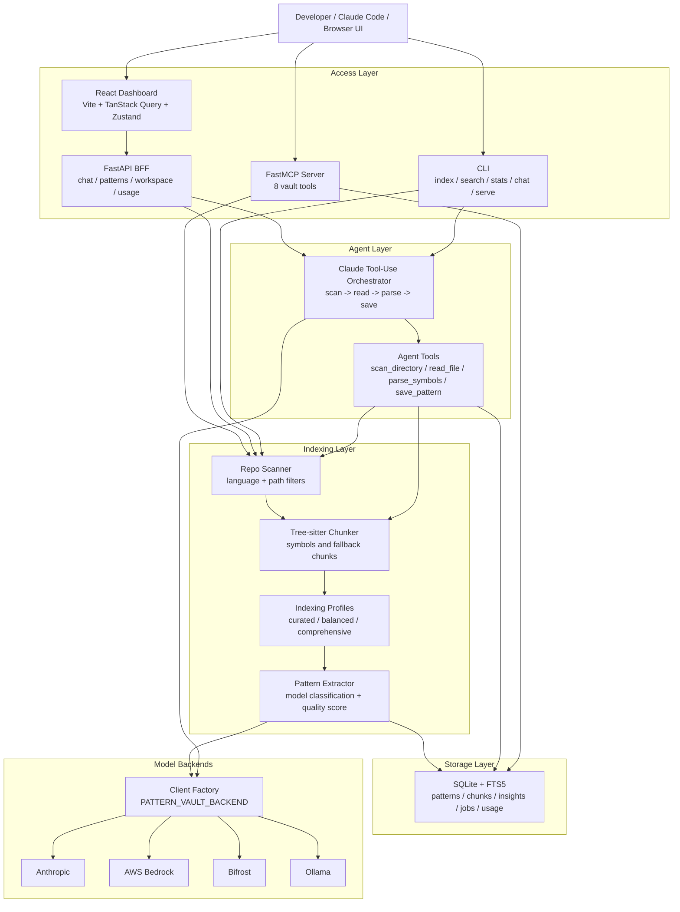

# Pattern Vault

Pattern Vault turns useful code from real repositories into a local, searchable library of reusable engineering patterns.

Most teams and individual developers repeatedly rebuild the same ideas: retry wrappers, auth middleware, queue consumers, test fixtures, config loaders, React hooks, FastAPI route structure, database access layers. The problem is not that examples do not exist. The problem is remembering which repository had the good version, why it was good, and how to bring it back into your current work.

Pattern Vault scans repositories, chunks source code with tree-sitter, asks a model to classify reusable patterns, and stores the useful ones in SQLite with full-text search. You can query it from the CLI, the React dashboard, or Claude Code through MCP.

## Why This Exists

Pattern Vault is for developers who learn by collecting strong examples from open source and their own previous projects.

It helps you:

- Build a personal memory of implementation patterns, not just bookmarks.
- Search by intent, category, language, tag, or source repository.
- Let Claude Code retrieve real examples from your vault while you are coding.
- Keep everything local by default in a single SQLite database.
- Control ingestion volume so the vault stays curated instead of becoming another noisy code dump.

## What It Does

- Scans local repositories and filters files before indexing.
- Uses tree-sitter to split source files into functions, classes, methods, and fallback text chunks.
- Classifies chunks as reusable patterns with a model backend.
- Supports curated, balanced, and comprehensive indexing profiles.
- Deduplicates stored patterns by content hash.
- Stores patterns, code chunks, repo insights, ingestion jobs, and token usage in SQLite.
- Searches with SQLite FTS5 and BM25 ranking.
- Exposes the vault through CLI commands, a FastMCP server, and a Vite React UI.
- Supports Anthropic direct, AWS Bedrock, Bifrost, and local Ollama-compatible models.

## Architecture



## Quick Start

Prerequisites:

- Python 3.10-3.13. Use 3.11-3.13 if you plan to run the legacy Chainlit UI.
- Node.js 20+ for the React dashboard.
- One model backend: Anthropic API key, AWS Bedrock access, Bifrost, or Ollama.

Install Python dependencies:

```bash
uv sync --extra web
cd web && npm ci
```

Choose a model backend:

```bash
# Direct Anthropic
export PATTERN_VAULT_BACKEND=anthropic
export ANTHROPIC_API_KEY=sk-ant-...

# Or AWS Bedrock
export PATTERN_VAULT_BACKEND=bedrock
export AWS_REGION=us-east-1
export AWS_ACCESS_KEY_ID=...
export AWS_SECRET_ACCESS_KEY=...

# Or Bifrost
export PATTERN_VAULT_BACKEND=bifrost
export BIFROST_URL=http://localhost:8080/anthropic
export PATTERN_VAULT_MODEL="bedrock/eu.anthropic.claude-haiku-4-5-20251001-v1:0"

# Or Ollama
export PATTERN_VAULT_BACKEND=ollama
export OLLAMA_BASE_URL=http://localhost:11434/v1
export PATTERN_VAULT_MODEL=qwen2.5-coder:7b
```

Index and search a repository:

```bash
uv run pv index /path/to/repo --profile curated
uv run pv search "retry with backoff"
uv run pv stats
```

Run the React dashboard:

```bash
./dev.sh start
```

The helper starts:

- FastAPI backend on `http://127.0.0.1:8001`
- Vite frontend on `http://127.0.0.1:5173`

Useful lifecycle commands:

```bash
./dev.sh status
./dev.sh restart
./dev.sh stop
```

## CLI

```bash
uv run pv index /path/to/repo --dry-run
uv run pv index /path/to/repo --profile curated
uv run pv search "auth middleware" --category api_pattern --language python
uv run pv search "worker queue" --full
uv run pv chat
uv run pv serve --transport http --host 127.0.0.1 --port 8000
```

Indexing profiles:

| Profile | Use When | Behavior |
|---|---|---|
| `curated` | You want signal over volume | Higher quality threshold, smaller storage budget |
| `balanced` | You want broader coverage | Moderate threshold and budget |
| `comprehensive` | You are exploring a repo deeply | Lower threshold, larger budget |

## React Dashboard

The current primary UI is the custom React dashboard in `web/`.

It includes:

- Vault overview with backend, database, category, language, and tag stats.
- Pattern browser and inspector.
- Chat panel backed by the agentic tool loop.
- Explorer and ingestion views for indexing local paths or cloned repos.
- Recent persisted ingestion jobs with replayable logs.
- Usage view for token usage events.
- MCP monitor for a dedicated HTTP MCP server.

Use `dev.sh` for normal local development:

```bash
./dev.sh start
./dev.sh status
./dev.sh restart
./dev.sh stop
```

The lower-level scripts are available when you intentionally want only one side of the stack.

Backend only:

```bash
./backend.sh start
./backend.sh status
./backend.sh stop
```

Run only the frontend:

```bash
cd web
npm ci
npm run dev
```

## Claude Code / MCP

Pattern Vault exposes an MCP server so Claude Code can search and retrieve your saved patterns during a coding session.

Stdio MCP config, useful for Claude Code when it launches the server process itself:

```json
{
  "mcpServers": {
    "pattern-vault": {
      "command": "uv",
      "args": [
        "run",
        "python",
        "-m",
        "pattern_vault.server.mcp_server"
      ],
      "cwd": "/absolute/path/to/pattern-vault"
    }
  }
}
```

The dashboard can also start a separate HTTP MCP server from the MCP Monitor panel. By default that server listens on `http://127.0.0.1:8002/mcp`, and can be configured with `PATTERN_VAULT_MCP_MONITOR_HOST` and `PATTERN_VAULT_MCP_MONITOR_PORT`.

HTTP MCP client config:

```json
{
  "mcpServers": {
    "pattern_vault_mcp": {
      "type": "http",
      "url": "http://127.0.0.1:8002/mcp"
    }
  }
}
```

This HTTP server is separate from the stdio process above. Start and stop it from the dashboard MCP panel, or run it manually with:

```bash
uv run pv serve --transport http --host 127.0.0.1 --port 8002
```

Then ask Claude Code:

- "Search my pattern vault for retry patterns."
- "What auth middleware patterns do I have indexed?"
- "Get the full code for pattern 12."
- "Index this repository using the curated profile."

MCP tools:

| Tool | Purpose |
|---|---|
| `search_patterns` | Search stored patterns with FTS5/BM25 |
| `get_pattern` | Retrieve full code and metadata for one pattern |
| `add_pattern` | Manually save a code pattern |
| `save_insight` | Save a repo-level observation |
| `list_tags` | List tags, optionally by category |
| `list_categories` | List categories |
| `vault_stats` | Return vault counts and metadata |
| `reindex` | Run batch indexing for a directory |

## How Indexing Works

1. Scan a repository and skip dependency/build/cache folders.
2. Apply optional language and path filters.
3. Chunk files with tree-sitter where a grammar is available.
4. Send small batches of chunks to the configured model backend.
5. Keep only chunks classified as reusable patterns for the selected profile.
6. Store patterns in SQLite and update the FTS5 index.

Default database path:

```bash
~/.pattern-vault/patterns.db
```

Override it:

```bash
export PATTERN_VAULT_DB=/path/to/patterns.db
```

## Configuration

| Variable | Default | Purpose |
|---|---|---|
| `PATTERN_VAULT_BACKEND` | `anthropic` | `anthropic`, `bedrock`, `bifrost`, or `ollama` |
| `PATTERN_VAULT_MODEL` | backend-specific | Override model ID |
| `PATTERN_VAULT_DB` | `~/.pattern-vault/patterns.db` | SQLite database path |
| `PATTERN_VAULT_WORKSPACE_ROOTS` | current working directory | `os.pathsep`-separated roots the agent may scan/read |
| `ANTHROPIC_API_KEY` | none | Required for direct Anthropic |
| `AWS_REGION` | `us-east-1` | Bedrock region |
| `AWS_ACCESS_KEY_ID` | none | Required for Bedrock unless another AWS credential source is used |
| `AWS_SECRET_ACCESS_KEY` | none | Required for Bedrock unless another AWS credential source is used |
| `AWS_SESSION_TOKEN` | none | Optional temporary AWS token |
| `BIFROST_URL` | none | Bifrost Anthropic-compatible endpoint |
| `BIFROST_API_KEY` | `dummy` | Bifrost virtual key |
| `OLLAMA_BASE_URL` | `http://localhost:11434/v1` | Ollama OpenAI-compatible endpoint |
| `OLLAMA_API_KEY` | `ollama` | Dummy key for OpenAI-compatible client |
| `PATTERN_VAULT_HISTORY_DIR` | `~/.pattern-vault/chat-history` | Chat history directory |
| `PATTERN_VAULT_MCP_MONITOR_HOST` | `127.0.0.1` | Host for the dashboard-managed HTTP MCP server |
| `PATTERN_VAULT_MCP_MONITOR_PORT` | `8002` | Port for the dashboard-managed HTTP MCP server |
| `PATTERN_VAULT_MCP_URL` | none | Optional HTTP MCP status URL for the legacy Chainlit UI |

## Development

Install dev dependencies:

```bash
uv sync --extra dev --extra web
cd web && npm ci
```

Run checks:

```bash
uv run --extra dev --extra web ruff check pattern_vault tests
uv run --extra dev --extra web pytest
cd web && npm run build
uv build
```

The GitHub Actions workflow runs backend lint/tests across Python 3.11, 3.12, and 3.13, builds and smoke-tests the Python wheel, and runs a frontend production build on Node 20.

## Packaging

The Python application is packaged as `pattern-vault`.

```bash
uv build
python -m pip install dist/pattern_vault-0.1.0-py3-none-any.whl
pv --help
```

Default install includes the CLI, MCP server, indexing pipeline, and core model clients. Optional extras keep heavyweight or UI-specific dependencies out of the base install:

```bash
pip install "pattern-vault[web]"        # FastAPI backend for the React dashboard
pip install "pattern-vault[legacy-ui]"  # Chainlit UI
pip install "pattern-vault[search]"     # planned vector/hybrid search dependencies
pip install "pattern-vault[bedrock]"    # Anthropic Bedrock extra dependencies
```

## Current Limitations

Bluntly: this is useful, but it is still early.

- Search is FTS5/BM25 only. Embeddings and hybrid semantic search are not wired yet.
- Reindexing is not incremental. Dedup prevents duplicate storage, but unchanged files can still consume model calls.
- Extraction is mostly sequential. Large repositories can be slow and expensive.
- The React build currently pulls many Shiki language/theme chunks; production bundle optimization is needed.
- The legacy Chainlit UI still exists, but the React dashboard is the direction of travel.
- Stored patterns depend on model judgment. Curated mode helps, but you should still review important patterns.

## Repository Map

```text
pattern_vault/
  api/                 FastAPI backend for the React UI
  agent/               Tool-use orchestrator and agent tools
  indexer/             Scanner, chunker, extractor, indexing profiles
  server/              FastMCP server
  store/               SQLite schema, migrations, CRUD, FTS search
  ui/                  Legacy Chainlit UI
  client.py            Model backend factory
  cli.py               CLI entry point

web/
  src/                 React dashboard
  package.json         Frontend scripts and dependencies
  vite.config.ts       Vite config and API proxy

tests/                 Backend regression tests
.github/workflows/     CI
CLAUDE.md              Developer-oriented project map
HANDOFF.md             UI redesign handoff notes
```

## License

Apache-2.0. See `LICENSE`.
