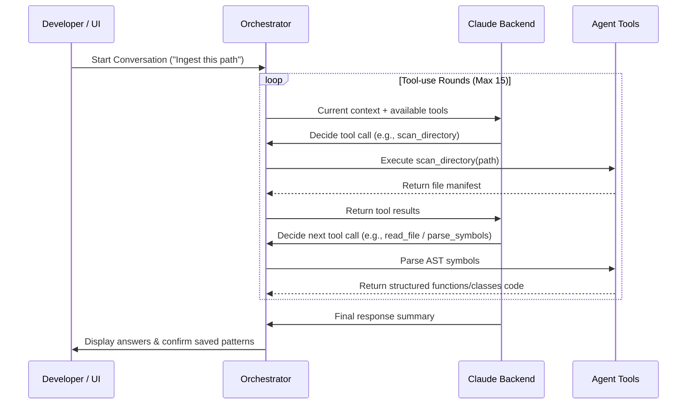

# Architecture Deep Dive

Pattern Vault is designed to provide maximum decoupling, fast local retrieval, and robust agent-driven codebase analysis. This page explains the core subsystems and data flows that make it work.

---

## Subsystem Layout

Pattern Vault is logically organized into five distinct layers:

```
┌─────────────────────────────────────────────────────────────────────┐
│  ACCESS LAYER                                                       │
│  ┌──────────────┐  ┌──────────────────┐  ┌───────────────────────┐  │
│  │ MCP Server   │  │ React UI + BFF   │  │ CLI                   │  │
│  │ (FastMCP)    │  │ (Vite + FastAPI) │  │ index/search/chat/    │  │
│  │ 8 tools      │  │ agentic loop     │  │ stats/serve           │  │
│  └──────┬───────┘  └────────┬─────────┘  └──────────┬────────────┘  │
│         │                   │                       │               │
│         └───────────────────┼───────────────────────┘               │
├─────────────────────────────┼───────────────────────────────────────┤
│  AGENT LAYER                │                                       │
│  ┌──────────────────────────┴──────────────────────────────────┐    │
│  │ Orchestrator (pattern_vault/agent/orchestrator.py)          │    │
│  │ Claude tool-use loop — Claude decides tool call sequence    │    │
│  └──────────────────────────┬──────────────────────────────────┘    │
├─────────────────────────────┼───────────────────────────────────────┤
│  INDEXING LAYER             │                                       │
│  ┌────────────┐  ┌──────────┴──┐  ┌────────────────────────────┐   │
│  │ Scanner    │→ │ Chunker     │→ │ Extractor                  │   │
│  │ glob+filter│  │ tree-sitter │  │ Claude API classification  │   │
│  └────────────┘  └─────────────┘  └─────────────┬──────────────┘   │
├─────────────────────────────────────────────────┼───────────────────┤
│  STORAGE LAYER                                  │                   │
│  ┌───────────────────────────────────────────────┴────────────────┐ │
│  │ SQLite + FTS5                                                  │ │
│  │ Tables: patterns, chunks, repo_insights, patterns_fts          │ │
│  └────────────────────────────────────────────────────────────────┘ │
├─────────────────────────────────────────────────────────────────────┤
│  CLIENT LAYER                                                       │
│  ┌────────────────────────────────────────────────────────────────┐ │
│  │ pattern_vault/client.py — Central client factory               │ │
│  └────────────────────────────────────────────────────────────────┘ │
└─────────────────────────────────────────────────────────────────────┘
```

---

## 1. The Indexing Pipeline (Batch Mode)

The batch indexing pipeline ingest folders cleanly and efficiently in four distinct phases:

### Phase A: Repository Scanning
The scanner (`pattern_vault/indexer/chunker.py`) traverses the target path. It applies a series of smart ignore patterns:
-   **Dependencies/Caches**: Ignores `.git`, `node_modules`, `venv`, `.venv`, `__pycache__`, `.pytest_cache`, and similar directories.
-   **Binary & Config Files**: Skips image formats, massive lockfiles (`package-lock.json`, `uv.lock`), and binary files.
-   **File Mapping**: Categorizes files by language using an internal `LANG_MAP` (supporting Python, JavaScript, TypeScript, and Go).

### Phase B: Tree-Sitter AST Chunking
Instead of splitting text files arbitrarily by character count (which breaks code context!), Pattern Vault uses **tree-sitter AST parsers**:
-   It breaks down source code into functional syntactic blocks, such as **classes**, **functions**, and **methods**.
-   If a language doesn't have an active tree-sitter grammar, the chunker falls back to logical line-based chunk boundaries.
-   This ensures the LLM receives complete, syntactically coherent modules of code to analyze.

### Phase C: Model Pattern Extraction
The raw code chunks are batched (`BATCH_SIZE=5`) and sent to the Extractor (`pattern_vault/indexer/extractor.py`):
-   The extractor prompts the LLM to classify whether a code chunk represents a **reusable engineering pattern** or is simply project-specific glue code.
-   If classified as a pattern, the LLM assigns:
    -   A descriptive **name** and **summary**.
    -   A **category** (e.g., `design_pattern`, `resilience`, `api_pattern`, `data_access`).
    -   A set of relevant **tags** (e.g., `fastapi`, `caching`, `decorator`).
    -   A **quality_score** (between 0.0 and 1.0) grading structural health and reusability.

### Phase D: Storage & FTS Deduplication
The database layer (`pattern_vault/store/db.py`) handles persistence:
-   **Deduplication**: Computes a SHA-256 hash of the code chunk. If the hash already exists in the database, the record is skipped, avoiding duplication.
-   **FTS5 indexing**: A SQLite Full-Text Search (FTS5) virtual table updates automatically via database triggers, maintaining sub-millisecond search capabilities across names, summaries, and categories.

---

## 2. The Agentic Loop (Interactive Mode)

When querying or analyzing codebases dynamically via the chat panel, Pattern Vault uses a **tool-use orchestrator loop** (`pattern_vault/agent/orchestrator.py`) rather than a hardcoded pipeline.



### Agent Tools Definition
The agent is empowered with 7 core tools (configured in `pattern_vault/agent/tools.py`):
1.  `scan_directory`: List directory structure, file extensions, and sizes.
2.  `read_file`: Retrieve up to 200 lines of file content for safe context consumption.
3.  `parse_symbols`: Extract functions, classes, and methods via tree-sitter AST.
4.  `save_pattern`: Manually persistence a pattern into the SQLite database.
5.  `save_insight`: Store repository-wide structural highlights.
6.  `search_patterns`: Search the existing pattern vault.
7.  `vault_stats`: Fetch stats about indexed contents.

---

## 3. Storage Layer Schema

The SQLite schema lives in `pattern_vault/store/db.py` under the database path `~/.pattern-vault/patterns.db`. The core tables include:

```sql
-- Pattern metadata
CREATE TABLE patterns (
    id TEXT PRIMARY KEY,
    name TEXT NOT NULL,
    category TEXT NOT NULL,
    language TEXT NOT NULL,
    tags TEXT, -- JSON array of strings
    summary TEXT NOT NULL,
    quality_signal REAL NOT NULL,
    source_repo TEXT NOT NULL,
    source_file TEXT NOT NULL,
    line_start INTEGER,
    line_end INTEGER,
    content_hash TEXT UNIQUE NOT NULL,
    created_at TIMESTAMP,
    updated_at TIMESTAMP
);

-- Actual code segments
CREATE TABLE chunks (
    id TEXT PRIMARY KEY,
    pattern_id TEXT REFERENCES patterns(id) ON DELETE CASCADE,
    code_text TEXT NOT NULL,
    chunk_type TEXT NOT NULL,
    embedding BLOB -- Reserved for hybrid vector search
);

-- Repository-level structural observations
CREATE TABLE repo_insights (
    id TEXT PRIMARY KEY,
    repo_path TEXT NOT NULL,
    insight_text TEXT NOT NULL,
    tags TEXT, -- JSON array
    created_at TIMESTAMP
);
```

---

## 4. Multi-Backend Client System

The client manager (`pattern_vault/client.py`) provides a single, unified interface for constructing synchronous and asynchronous model clients. It translates requests seamlessly between:
-   **Anthropic's Native SDK**: Direct API queries.
-   **AWS Bedrock Wrapper**: Secure enterprise cloud authentication.
-   **Bifrost Proxy**: Custom URL endpoints.
-   **OpenAI SDK Client Adaptor**: Wrap local `Ollama` JSON payloads into Anthropic-compatible format, allowing offline models like `qwen2.5-coder` or `llama3` to be dropped in without changing the orchestrator code.
