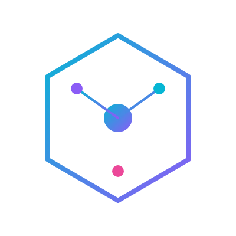
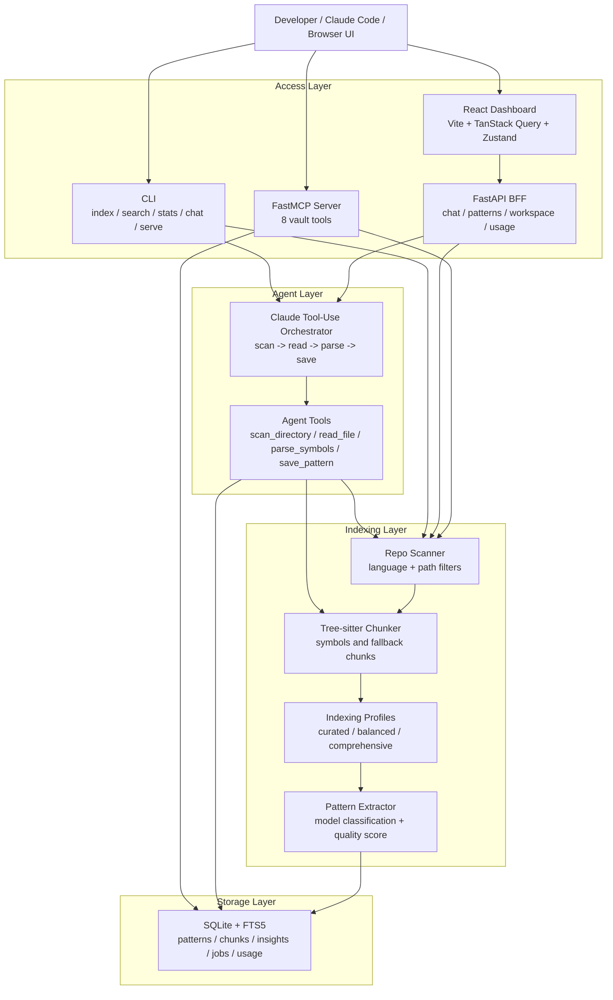

# Pattern Vault

<p align="center">
  
</p>

> **Turn real code into a local, searchable library of reusable engineering patterns.**

Pattern Vault scans your repositories, parses their source files into AST symbols using **tree-sitter**, classifies which components represent reusable software patterns using a **large language model**, and compiles them into a highly searchable local **SQLite FTS5 database**.

Once stored, you can query, inspect, and retrieve these patterns from your **terminal (CLI)**, a **custom React web dashboard**, or directly within your IDE (like Cursor or Claude Code) via the **Model Context Protocol (MCP)**.

---

## Key Features

<div class="grid cards" markdown>

-   :material-magnify: **Intent-Based Search**

    Search your entire codebase vault by intent, natural language, programming language, category, or source repository using fast BM25 ranking.

-   :material-robot: **Agentic Analysis Loop**

    An interactive agentic loop powered by Claude that can scan directories, read files, parse AST symbols, and auto-classify architecture patterns under your guidance.

-   :material-server: **Model Context Protocol (MCP)**

    An out-of-the-box MCP server supporting stdio and HTTP transport so Claude Code or Cursor can fetch real, tested implementation examples while you code.

-   :material-laptop: **Sleek React Dashboard**

    A modern, glassmorphic React 19 interface with workspace ingestion tracking, log playback, token usage graphs, and an interactive agent chat panel.

-   :material-shield-key: **Completely Local & Private**

    Keep everything secure. By default, your database lives in a local SQLite file (`~/.pattern-vault/patterns.db`) with zero external storage requirements.

-   :material-puzzle: **Multi-Backend Models**

    Works with Anthropic Claude API, AWS Bedrock, Bifrost, or local models using Ollama-compatible endpoints (e.g., Qwen 2.5 Coder).

</div>

---

## Architecture Overview

Pattern Vault is structured into decoupled, robust layers:



---

## In Action

### 1. Ingest Patterns via CLI
```bash
uv run pv index /path/to/my-project --profile curated
```

### 2. Search Intent from Terminal
```bash
uv run pv search "retry with exponential backoff" --language python
```

### 3. Retrieve inside IDE using Claude Code
```text
User: "Search my pattern vault for auth middleware."
Claude: "I found a pattern: JWT Auth Middleware (FastAPI, Quality: 0.92) in repo backend-services..."
```

---

## Getting Started

Ready to build your personal codebase memory? Proceed to the [Getting Started Guide](getting-started.md) to set up your environment, install dependencies, and run your first indexing job in under five minutes!
