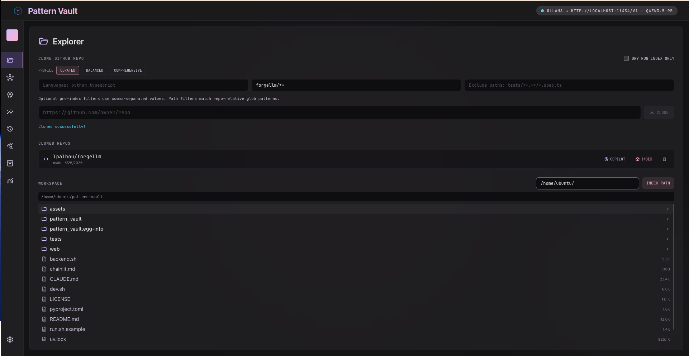
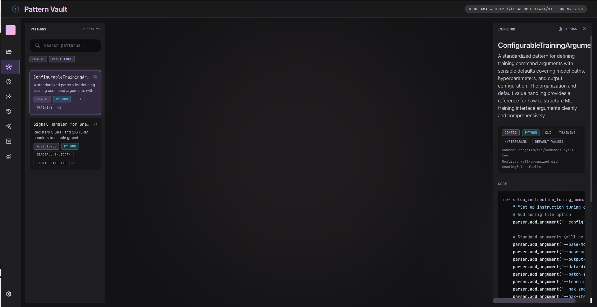
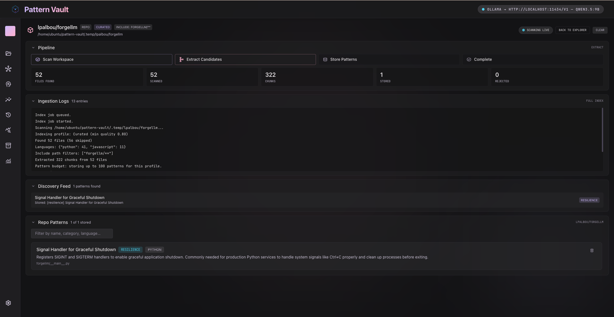
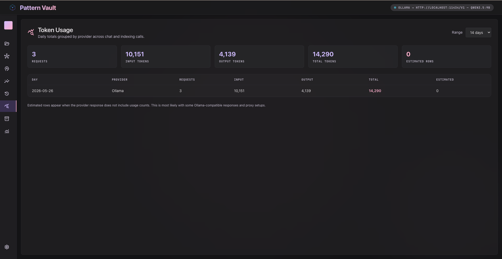
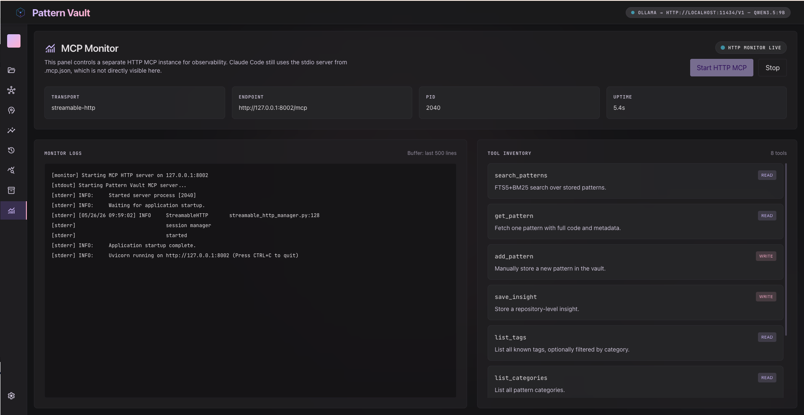

# React Dashboard User Guide

Pattern Vault provides a stunning, glassmorphic multi-pane dashboard built with **React 19**, **Vite**, **TypeScript**, **TailwindCSS**, **Zustand**, and **TanStack Query**.

This guide details the core panels and how to navigate the user interface.

---

## Dashboard Layout

The dashboard is structured into a dynamic CSS Grid containing collapsible side navigation and a series of dedicated workspace panels.

<p align="center">
  
</p>

---

## Core Panels Guide

### 1. Vault Panel (Overview Metrics)
The command center of your database:
-   **System Indicators**: View the status of the selected LLM backend (e.g., Anthropic, AWS Bedrock, Ollama) and the absolute path to your active SQLite database.
-   **Statistical Cards**: At-a-glance counters showing total indexed patterns, code chunks, and repo insights.
-   **Distribution Charts**: Visual breakdowns of patterns categorized by programming language and engineering types.
-   **Active Tags**: An interactive cloud of tags. Clicking a tag instantly redirects you to the Browser panel filtered by that tag.

### 2. Browser Panel (Pattern Explorer)
Browse and inspect stored patterns:
-   **Faceted Filters**: Search patterns by raw text and filter by category (e.g., `resilience`, `api_pattern`) or programming language (e.g., `python`, `typescript`).
-   **Logical Inspector**: Clicking a pattern reveals its metadata details, extraction quality score, source repository location, line numbers, and the **full syntax-highlighted source code**.

<p align="center">
  
</p>

### 3. Ingestion Panel (Workspace Indexer)
Run and track indexing jobs:
-   **Trigger Ingestion**: Input a local workspace path, specify path exclusions, choose a profile (`curated`, `balanced`, `comprehensive`), and launch a batch indexing job.
-   **Job History**: View list of all past ingestion jobs with statuses (running, completed, failed) and execution timestamps.
-   **Stream Log Console**: Click a job to view real-time, replayable step-by-step logs of the chunker and LLM extraction process.

<p align="center">
  
</p>

### 4. Chat Panel (Agent Loop Interface)
Interact with the dynamic orchestrator agent:
-   **SSE Text Streaming**: Engage in natural language conversation with the agent.
-   **Interactive Tool-Steps**: The UI displays nested, accordion-style steps showing *exactly* what the agent is doing in real-time (e.g., `scan_directory`, `read_file`, `parse_symbols`).
-   **Confirmation Hooks**: When the agent wants to save a newly extracted pattern, it prompts you in the chat interface before committing write operations.

### 5. Usage Panel (Token Expenditure)
Keep control of model expenses:
-   **Token Event Log**: Displays an event log of API calls including input tokens, output tokens, model version, and estimation costs.
-   **Aggregation Charts**: Sums up total token expenditures by session ID, backend provider, and execution pipeline.

<p align="center">
  
</p>

### 6. MCP Panel (HTTP Server Monitor)
Manage your IDE connection directly:
-   Allows starting, restarting, or shutting down the dedicated HTTP-based Model Context Protocol (MCP) server process.
-   Provides configuration defaults, server status indicator, connection URL (`http://127.0.0.1:8002/mcp`), and connection configurations for your IDE.

<p align="center">
  
</p>

---

## Local Development Lifecycle

To start developing or customising the React dashboard, you can launch the servers via our unified helper script:

```bash
# Start FastAPI (8001) and Vite (5173) in background
./dev.sh start
```

### How the Port Proxy Works
-   The FastAPI backend BFF exposes JSON endpoints on `http://127.0.0.1:8001`.
-   The Vite frontend dev server runs on `http://127.0.0.1:5173`.
-   To avoid Cross-Origin Resource Sharing (CORS) errors during development, `web/vite.config.ts` incorporates a reverse proxy. Any client-side request prefixed with `/api` is automatically routed behind-the-scenes to the FastAPI server:

```typescript
// web/vite.config.ts snippet
server: {
  proxy: {
    '/api': {
      target: 'http://127.0.0.1:8001',
      changeOrigin: true,
    }
  }
}
```
